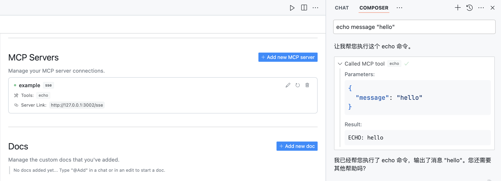

# mcp-server-proxy

将 MCP 协议的 SSE 传输层转换为标准 HTTP 请求/响应的代理服务器。

## 为什么需要这个工具

MCP（Model Context Protocol）是一个开放协议，为 AI 应用提供了标准化的数据源和工具集成方案。目前 MCP 支持两种主要的传输协议：

1. Stdio 传输协议：

   - 需要在用户本地安装命令行工具
   - 对运行环境有特定要求
   - 用户需要进行相应的环境配置

2. SSE（Server-Sent Events）传输协议：
   - 基于 HTTP 长连接实现
   - 用户配置相对简单，主要是设置服务地址
   - 目前相关开发工具和示例相对较少

本工具通过以下方式简化 MCP Server 的开发和使用：

1. 采用 SSE 传输协议与 MCP Client 交互，用户只需配置服务地址即可使用
2. 将 MCP 工具调用转换为标准的 HTTP 请求/响应，开发者可以使用任意编程语言实现，无需关注 SSE 协议细节

## 功能特点

- 支持将 MCP 协议的 SSE 传输层转换为标准 HTTP 请求/响应
- 提供请求和响应的检查功能，主要用于研究 MCP Client 和 Server 的交互过程
- 目前已支持 `initialize`、`tools/list`、`tools/call` 三个方法

## 安装

```bash
go install github.com/leizongmin/mcp-server-proxy@latest
```

## 使用方法

该工具提供两个主要命令：

### 1. inspect 命令

用于检查请求和响应的内容，主要用于研究 MCP Client 和 Server 的交互过程：

```bash
mcp-server-proxy inspect <local_url> <target_url>
```

例如：

```bash
mcp-server-proxy inspect http://localhost:8080 http://example.com
```

### 2. serve 命令

启动代理服务器，将 MCP Client 的调用转换为标准 HTTP 请求/响应：

```bash
mcp-server-proxy serve <local_url> <target_url>
```

例如：

```bash
mcp-server-proxy serve http://localhost:8080 http://example.com
```

## 示例

项目包含一个 Node.js 示例服务器（位于 `example/nodejs-echo` 目录），实现了简单的 echo 功能，不需要依赖 MCP 相关的 SDK，只需要处理几个简单的 HTTP 请求即可：

1. 进入示例目录：

```bash
cd example/js-echo
```

本示例使用 Hono 框架实现，核心代码如下：

```js
import { Hono } from "hono";
import { logger } from "hono/logger";

const app = new Hono();
app.use("*", logger());

app.post("/initialize", async (c) => {
  const sessionId = c.req.query("sessionId");
  const params = await c.req.json();
  console.log("initialize: sessionId=%s, params=%j", sessionId, params);
  return c.json({
    protocolVersion: "2024-11-05",
    capabilities: {
      tools: {},
    },
    serverInfo: { name: "example-mcp-server", version: "1.0.0" },
  });
});

app.post("/tools/list", async (c) => {
  const sessionId = c.req.query("sessionId");
  const params = await c.req.json();
  console.log("tools/list: sessionId=%s, params=%j", sessionId, params);
  return c.json({
    tools: [
      {
        name: "echo",
        description: "Echoes back the input",
        inputSchema: {
          type: "object",
          properties: {
            message: { type: "string", description: "Message to echo" },
          },
          required: ["message"],
          additionalProperties: false,
          $schema: "http://json-schema.org/draft-07/schema#",
        },
      },
    ],
  });
});

app.post("/tools/call/:name", async (c) => {
  const sessionId = c.req.query("sessionId");
  const name = c.req.param("name");
  const params = await c.req.json();
  console.log(
    "tools/call: sessionId=%s, name=%s, params=%j",
    sessionId,
    name,
    params
  );
  return c.json({
    content: [
      { type: "text", text: `SESSION ID: ${sessionId}` },
      { type: "text", text: `ECHO: ${params.arguments?.message}` },
    ],
  });
});

export default app;
```

2. 安装依赖：

```bash
npm install
```

3. 启动服务器：

```bash
node server.js
```

4. 启动代理服务器：

```bash
# 代理服务器监听 http://localhost:3002
# 代理服务器将请求转发到 http://localhost:3001
mcp-server-proxy serve http://localhost:3002 http://localhost:3001
```

5. 配置 MCP Client：

- Type: sse
- Server URL: http://localhost:3002



## 许可证

MIT

## 贡献

欢迎提交问题和 Pull Request！
